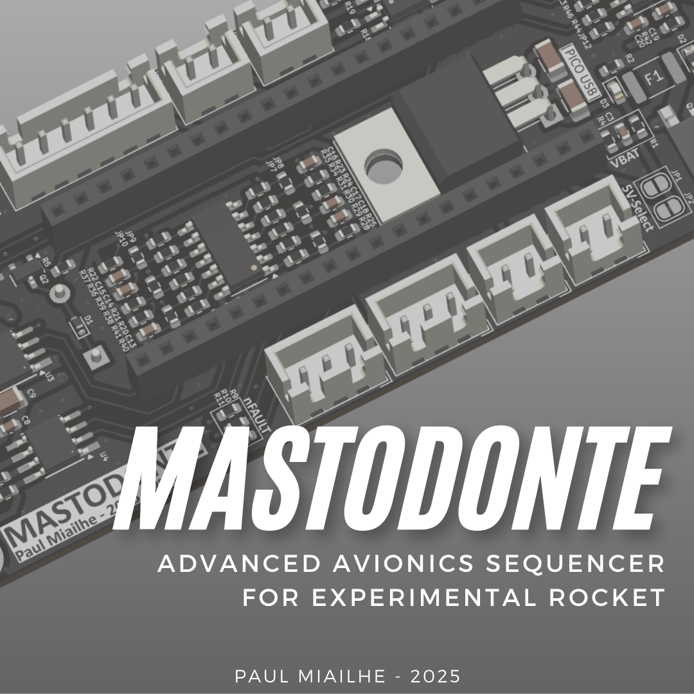
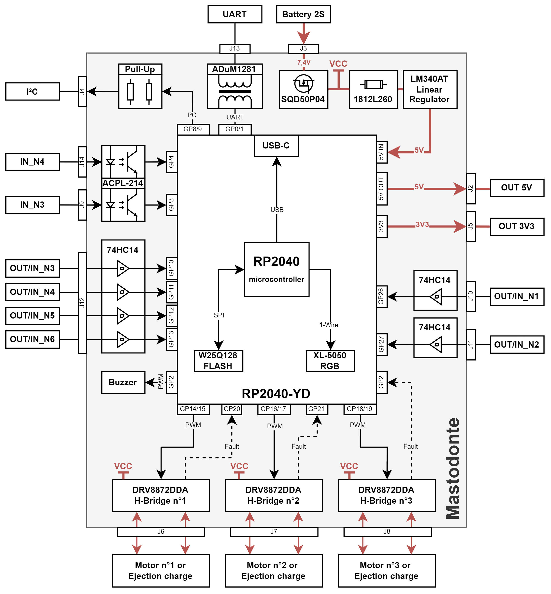

# Flight Software Mastodonte

**FlightSoftware-Mastodonte** is the embedded flight software running on the **YD-RP2040** controller of the experimental rocket **Mastodonte**.  
It acts as the onboard **flight sequencer**, managing time-critical events and hardware interfaces during the mission.

> © 2025 Paul Miailhe – Designed for safety-critical embedded rocket systems.

---

  

---

## Features

- Arduino framework (Earle Philhower core) on RP2040
- Built-in WS2812B RGB LED control (no external wiring)
- Passive buzzer management with programmable tone and timing
- OLED display via I²C with auto-detection
- Debug interface with optional serial logging (timeout-protected)
- CMSIS-DAP support for flashing and debugging (via SWD)
- Modular C++ architecture (timers, state machines, IO abstraction)
- Compatible with 16MB flash layout (1MB sketch / 15MB filesystem)

---

## Platform Configuration

| Parameter           | Value                    |
|---------------------|--------------------------|
| Board               | `YD-RP2040`              |
| MCU                 | RP2040                   |
| Framework           | Arduino (earlephilhower) |
| Debug protocol      | CMSIS-DAP (SWD)          |
| Flash layout        | 1MB firmware / 15MB FS   |
| Clock frequency     | 133 MHz                  |
| USB stack           | TinyUSB                  |
| Toolchain           | `toolchain-rp2040-earlephilhower` |
| Build system        | PlatformIO               |

---

## External Libraries

Declared in `platformio.ini`:

| Library                      | Version   | Purpose                      |
|-----------------------------|-----------|------------------------------|
| Adafruit NeoPixel           | `1.12.5`  | WS2812B LED control          |
| Adafruit SSD1306            | `2.5.7`   | OLED I²C display             |
| Adafruit GFX                | `1.11.9`  | Core graphics (OLED backend) |

---

## Synoptic

  

---

## 🚦 Flight Sequencer States

The system is driven by a finite state machine (`sequencer.cpp`) that transitions through various mission phases.  
Each state configures RGB LED color and buzzer behavior to provide **visual and audible feedback**.

| State           | Color (LED)      | Buzzer Pattern                      | Description |
|------------------|------------------|--------------------------------------|-------------|
| `PRE_FLIGHT`     | 🟢 Green          | 🔈 Double soft beep (3s pause)       | System idle on ground, RBF and JACK expected. |
| `PYRO_RDY`       | 🟡 Yellow         | 🔈 1 low beep per second             | Ready for liftoff, RBF removed, JACK still in. |
| `ASCEND`         | 🔵 Blue           | 🔈 Very fast beeping                 | Liftoff confirmed, rocket in ascent. |
| `WINDOW`         | 🔵 Cyan           | 🔈 Rapid alert beeping               | Deployment window is open (timed or triggered). |
| `DEPLOY_ALGO`    | 🟠 Orange         | 🔈 Alternating mid beeps             | Deployment triggered via algorithm (sensor). |
| `DEPLOY_TIMER`   | 🟠 Orange         | 🔈 Alternating mid beeps             | Deployment triggered via timer timeout. |
| `DESCEND`        | 🟣 Magenta        | 🔈 Slow and regular beeping          | Descent under parachute. |
| `TOUCHDOWN`      | 🟢 Green (steady) | 🔈 Long beep every 30 seconds        | Touchdown detected, safe recovery state. |
| `ERROR_SEQ`      | 🔴 Red            | 🔈 Rapid high-pitched beeping        | System fault or invalid state transition. |

---

## 🔘 User Button USR (GP24) — Log Dump & Erase

A user-accessible button is connected to **GPIO 24** and is checked during system boot.

- **Press and release**: Dumps log content to Serial @ **115200 baud**.
- **Press and hold for 5 seconds**: Erases the entire log file from the onboard flash memory.

This provides a fast and safe way to extract and reset logs without reflashing the system.

---