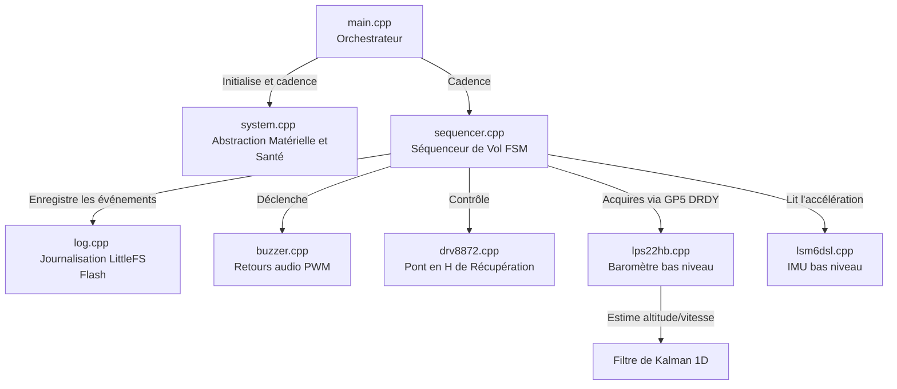

# Logiciel de Vol Mastodonte

**FlightSoftware-Mastodonte** est le micrologiciel de vol critique embarqué s'exécutant sur le contrôleur **YD-RP2040**. 
Conçu pour orchestrer les événements de vol temps réel, il assure l'acquisition de données à haute fréquence, le filtrage de trajectoire par Kalman, la détection redondante de l'apogée, et le pilotage sécurisé des actionneurs de récupération (moteurs de déploiement).

> *Copyright (c) 2025/2026 - Paul Miailhe.*  
> *This firmware source code is licensed under GNU General Public License v3. [→ GNU GPLv3](https://www.gnu.org/licenses/gpl-3.0)*

[](https://berryrocket.com)
[](https://www.gnu.org/licenses/gpl-3.0)

---

<p align="center">
  
</p>

---

## 🛠️ Fonctionnalités Clefs

- **Cœur natif Pico SDK (I2C Dédié)** : Implémentation d'un pilote I2C bas niveau personnalisé (accès direct aux registres matériels) pour les capteurs sur le bus `i2c1` (GP6/GP7) cadencé à 400 kHz, assurant des transactions ultra-rapides et déterministes.
- **Filtrage de Kalman 1D Temps Réel** : Estimateur d'état à deux variables (altitude et vitesse verticale) fonctionnant à 25 Hz, synchronisé de manière stricte sur l'interruption matérielle de la broche `GP5` (Data-Ready du baromètre).
- **Détection d'Apogée Triplement Redondante** : Fusion de données combinant l'algorithme de vitesse de Kalman ($z > 15\text{ m}$ et $v_z \le -1.0\text{ m/s}$ sur 5 cycles consécutifs, soit ~200 ms) et la détection d'état de deux interrupteurs physiques via optocoupleurs matériels.
- **Autotests & Diagnostics Moteurs** : Diagnostic complet des ponts en H `DRV8872` au démarrage pour détecter d'éventuels courts-circuits ou surchauffes. Gestion d'un bypass temporaire des interruptions de défaut au moment de l'allumage pour tolérer les pics de courant initiaux des moteurs.
- **Surveillance Batterie & Sécurité** : Mesure de tension via convertisseur ADC (GP28) cadencée à 1 Hz avec alertes visuelles dynamiques (clignotement de la LED d'état RGB WS2812B en cas de tension $\le 6.0\text{V}$).
- **Journalisation sur Flash LittleFS** : Écriture asynchrone non bloquante des événements de vol et des données de télémétrie sur le système de fichiers LittleFS (mémoire flash interne du RP2040) pour analyse post-vol.
- **Support CMSIS-DAP** : Entièrement compatible avec les sondes de débogage SWD pour l'acquisition en direct des variables de vol et le flashage rapide.

---

## 📐 Architecture Logicielle

Le code source est structuré selon une approche modulaire stricte, séparant l'abstraction matérielle (HAL), la logique de la machine d'état de vol, et les tâches asynchrones d'arrière-plan.


```mermaid
graph TD
    Main[main.cpp <br/> Orchestrateur] -->|Initialise et cadence| Sys[system.cpp <br/> Abstraction Matérielle et Santé]
    Main -->|Cadence| Seq[sequencer.cpp <br/> Séquenceur de Vol FSM]
    Seq -->|Enregistre les événements| Log[log.cpp <br/> Journalisation LittleFS Flash]
    Seq -->|Déclenche| Buzzer[buzzer.cpp <br/> Retours audio PWM]
    Seq -->|Contrôle| Motors[drv8872.cpp <br/> Pont en H de Récupération]
    Seq -->|Acquires via GP5 DRDY| Baro[lps22hb.cpp <br/> Baromètre bas niveau]
    Baro -->|Estime altitude/vitesse| Kalman[Filtre de Kalman 1D]
    Seq -->|Lit l'accélération| IMU[lsm6dsl.cpp <br/> IMU bas niveau]
```

### Description des Modules principaux

*   **`main.cpp` (Orchestrateur)** : Le point d'entrée central du système. Il orchestre la phase d'initialisation matérielle dans `setup()` (diagnostics,LittleFS, capteurs) et cadence l'exécution du séquenceur, de la batterie et de l'écriture des logs dans `loop()`.
*   **`sequencer.cpp` (Logique de vol / FSM)** : Implémente la machine d'état finie (FSM) gérant les états de vol (du sol `PRE_FLIGHT` à l'atterrissage `TOUCHDOWN`). Il réagit exclusivement aux interruptions matérielles (Jack de décollage et RBF) pour assurer des transitions instantanées et déterministes.
*   **`lps22hb.cpp` & `lsm6dsl.cpp` (Pilotes Capteurs)** : Modules bas niveau communiquant directement avec les registres I2C. Le pilote du baromètre gère le filtre de Kalman 1D et l'algorithme de détection d'apogée dans sa propre routine d'interruption (ISR).
*   **`system.cpp` (HAL)** : Regroupe le contrôle matériel des broches GPIO de la carte, la gestion de la LED RGB intégrée (WS2812B) et le chronométrage du timer de tension de batterie.
*   **`log.cpp` (Journalisation de vol)** : Enregistreur robuste utilisant LittleFS. Il stocke les logs dans un tampon RAM et n'écrit physiquement sur la flash qu'à des instants précis du vol afin de ne jamais perturber la boucle critique.

---

## Configuration Matérielle

| Paramètre           | Valeur                    |
|---------------------|--------------------------|
| Carte               | `YD-RP2040`              |
| Microcontrôleur     | RP2040                   |
| Framework           | Arduino (earlephilhower) |
| Protocole de debug  | CMSIS-DAP (SWD)          |
| Découpage Flash     | 1 Mo firmware / 15 Mo FS |
| Fréquence d'horloge | 133 MHz                  |
| Pile USB            | TinyUSB                  |
| Chaîne de compil.   | `toolchain-rp2040-earlephilhower` |
| Système de build    | PlatformIO               |
| Pin Mesure Batterie | GP28 (ADC2)              |
| Pin Interrup. Baro  | GP5                      |

---

## Bibliothèques Externes

Déclarées dans `platformio.ini` :

| Bibliothèque                 | Version   | Rôle                             |
|------------------------------|-----------|----------------------------------|
| Adafruit NeoPixel            | `1.12.5`  | Contrôle de la LED WS2812B       |

---

## Synoptique

<p align="center">
  
</p>

---

## 🚀 Guide de Démarrage Rapide (Quickstart)

### 1. Prérequis Logiciels
*   Installer [VS Code](https://code.visualstudio.com/).
*   Installer l'extension **PlatformIO IDE** depuis le gestionnaire d'extensions de VS Code.

### 2. Compilation du Projet
1.  Ouvrir VS Code, puis ouvrir le dossier du projet `FlightSoftware-Mastodonte`.
2.  Laisser PlatformIO configurer l'environnement (cela peut prendre quelques minutes au premier démarrage).
3.  Cliquer sur l'icône de **coche (✓)** dans la barre d'état inférieure de VS Code (Build) ou exécuter la commande suivante dans le terminal :
    ```bash
    pio run
    ```

### 3. Téléversement / Flashage de la Carte YD-RP2040
Le téléversement se fait via USB :
1.  Brancher la carte YD-RP2040 à votre ordinateur avec un câble USB-C.
2.  Maintenir enfoncé le bouton **BOOT** (situé sur la carte), appuyer brièvement sur le bouton **RST** (Reset), puis relâcher le bouton BOOT.
3.  La carte apparaît sur l'ordinateur comme une clé USB nommée **`RPI-RP2`**.
4.  Cliquer sur la **flèche (→)** dans la barre d'état de PlatformIO (Upload) pour flasher. Vous pouvez aussi copier-coller manuellement le fichier binaire `.pio/build/pico/firmware.uf2` directement sur la clé USB `RPI-RP2`. La carte redémarrera automatiquement dès la fin du transfert.

### 4. Console de Débogage (Serial Monitor)
*   Ouvrir le moniteur série de PlatformIO (l'icône de prise électrique) pour visualiser la télémétrie et le statut du vol en direct à **`115200 bauds`**.
*   **Comportement au Boot** : Si `DEBUG_ENABLED` est activé, la carte attend jusqu'à 10 secondes l'ouverture de la console série USB avant de démarrer pour que vous ne manquiez pas les premiers logs d'initialisation.

---

## Tolérance aux Pannes & Diagnostics

### Signaux Sonores de Démarrage (Beep Codes)
Au démarrage, le buzzer fournit un diagnostic audio immédiat de l'état du système :
- **2 bips courts (1500 Hz)** : Initialisation du baromètre (`LPS22HB`) réussie.
- **3 bips plus longs (1200 Hz)** : Échec de l'initialisation du baromètre ou capteur physiquement absent. Le système bascule automatiquement en **Mode de Vol Fenêtré Uniquement** (sécurité temporelle).
- **2 bips courts (1500 Hz) après maintien de USR (GP24) pendant 5s** : Effacement réussi du fichier de logs sur la flash.

### Résilience en Vol face à une Déconnexion du Baromètre
Si le baromètre est déconnecté physiquement ou perd son alimentation pendant le vol :
1. **Sécurité CPU (Anti-figeage)** : Le contrôleur I2C du RP2040 détecte l'absence de réponse (NACK). Le pilote bas niveau non bloquant retourne instantanément un code d'erreur (`PICO_ERROR_GENERIC`) sans bloquer la boucle principale ni le séquenceur.
2. **Désactivation des Interruptions** : Le baromètre générant lui-même les interruptions sur `GP5` (DRDY), sa déconnexion arrête l'envoi de ces signaux. Le callback `lps22hb_drdy_callback` cesse donc d'être exécuté, stoppant toute tentative de transaction I2C vers le capteur.
3. **Timers de Secours du Séquenceur** :
   - **Apogée / Déploiement** : Si le filtre de Kalman ne peut plus détecter l'apogée, le timer de fin de fenêtre de vol (`WINDOW_DURATION_US`) prend le relais pour déclencher le déploiement de secours (`DEPLOY_TIMER`).
   - **Atterrissage (Touchdown)** : Si la stabilisation au sol ne peut plus être calculée par Kalman, un timer de descente théorique (`THEORETICAL_DESCENT_US`) force le passage à l'état final sécurisé `TOUCHDOWN`.

---

## États du Séquenceur de Vol

La logique de vol est pilotée par une machine d'état finie (`sequencer.cpp`). Chaque état configure une couleur de LED RGB et un motif sonore spécifique pour un retour d'information clair à l'opérateur.

| État            | Couleur (LED)    | Motif du Buzzer                      | Description |
|-----------------|------------------|--------------------------------------|-------------|
| `PRE_FLIGHT`    | 🟢 Vert          | 🔈 Double bip doux (pause de 3s)     | Fusée au sol, en attente de l'armement (RBF inséré, Jack connecté). |
| `PYRO_RDY`      | 🟡 Jaune         | 🔈 1 bip grave par seconde           | Armé et prêt pour le décollage (RBF retiré, Jack toujours connecté). |
| `ASCEND`        | 🔵 Bleu          | 🔈 Bips très rapides                 | Décollage détecté (retrait du Jack), fusée en phase de montée. |
| `WINDOW`        | 🔵 Cyan          | 🔈 Bips d'alerte rapides             | Fenêtre d'ouverture de la récupération ouverte. |
| `DEPLOY_ALGO`   | 🟠 Orange        | 🔈 Bips alternés moyens              | Déploiement activé par détection algorithmique (capteurs). |
| `DEPLOY_TIMER`  | 🟠 Orange        | 🔈 Bips alternés moyens              | Déploiement activé sur secours temporel. |
| `DESCEND`       | 🟣 Magenta       | 🔈 Bips lents et réguliers           | Descente sous parachute. |
| `TOUCHDOWN`     | 🟢 Vert (fixe)   | 🔈 Long bip toutes les 30 secondes   | Atterrissage détecté, sécurisation au sol. |
| `ERROR_SEQ`     | 🔴 Rouge         | 🔈 Bips aigus très rapides           | Défaut système ou transition d'état invalide. |

> [!TIP]
> **Alerte de Tension Batterie Basse :**
> Si la tension descend sous **6.0V** pendant la préparation (états `PRE_FLIGHT` ou `PYRO_RDY`), la LED clignote alternativement entre la **couleur de l'état actuel** et le **Rouge** toutes les secondes. Cette alerte n'est pas bloquante pour permettre un lancement forcé, mais signale une batterie faible.

---

## 🔘 Bouton Utilisateur USR (GP24) — Lecture et Effacement

Le bouton connecté sur **GPIO 24** est lu au démarrage :
- **Appui court** : Vide le contenu des fichiers de logs vers la liaison série USB à **115200 bauds**.
- **Appui long (5 secondes)** : Efface complètement le fichier de logs de la mémoire flash interne.

---

## 🛰️ Option : Carte Capteurs BR Mini Sensor

Ce logiciel prend en charge l'acquisition et le filtrage des données de vol (Kalman 1D) via la carte mezzanine **BR Mini Sensor** (équipée d'un accéléromètre/gyromètre LSM6DSL et d'un baromètre LPS22HB).

Pour plus d'informations sur le câblage, le brochage et les détails matériels de cette carte, veuillez vous référer à la documentation officielle :
👉 **[Wiki BR Mini Sensor](https://berryrocket.com/wiki/BR_Mini_Sensor)**
