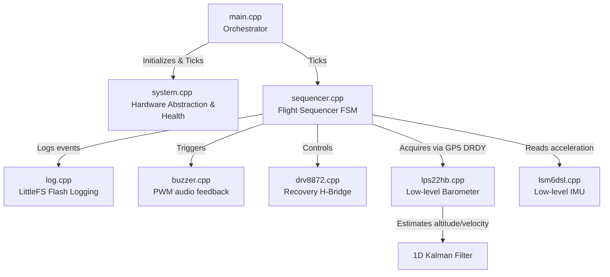

# Flight Software Mastodonte

**FlightSoftware-Mastodonte** is the embedded flight software running on the **YD-RP2040** controller of the experimental rocket **Mastodonte**.  
It acts as the onboard **flight sequencer**, managing time-critical events and hardware interfaces during the mission.

> © 2025 Paul Miailhe – Designed for safety-critical embedded rocket systems.

---

  

---

## Features

- **Pico SDK Native Core**: Custom low-level registers-only I2C driver for sensors on `i2c1` (GP6/GP7) operating at 400 kHz.
- **1D Kalman Filtering**: Estimator running at 25 Hz synchronized on `GP5` (DRDY) hardware interrupt to track altitude and vertical velocity.
- **Apogee Detection**: Redundant multi-sensor detection combining dual optocouplers and Kalman filter apogee trigger ($z > 15\text{ m}$ and $v_z \le -1.0\text{ m/s}$ for 5 consecutive samples).
- **Safety Auto-Bypass & Alarm**: Automatic sensor health autotest at boot; if the barometer is absent, the system emits 3 bips (instead of 2) and falls back safely to **Windowing Only Flight Mode**.
- **Non-blocking battery monitoring**: Continuous voltage monitoring via hardware timer (1 Hz frequency) with smart LED warnings when $V_{cc} \le 6.0\text{V}$.
- **H-Bridge Recovery Driver**: Autonomous safety control for recovery motors with temporary startup current spike bypass at liftoff.
- **USB Mass Storage (MSC)**: Virtual read-only log dump simulator via USB serial, and physical GP24 button to dump/clear LittleFS logs.
- **CMSIS-DAP support**: Flashing and debug support (SWD).

---

## Software Architecture

The flight software is built with a highly modular C++ structure to enforce separation of concerns, safety-critical execution, and predictability.

```mermaid
graph TD
    Main[main.cpp <br/> Orchestrator] -->|Initializes & Ticks| Sys[system.cpp <br/> Hardware Abstraction & Health]
    Main -->|Ticks| Seq[sequencer.cpp <br/> Flight Sequencer FSM]
    Seq -->|Logs events| Log[log.cpp <br/> LittleFS Flash Logging]
    Seq -->|Triggers| Buzzer[buzzer.cpp <br/> PWM audio feedback]
    Seq -->|Controls| Motors[drv8872.cpp <br/> Recovery H-Bridge]
    Seq -->|Acquires via GP5 DRDY| Baro[lps22hb.cpp <br/> Low-level Barometer]
    Baro -->|Estimates altitude/velocity| Kalman[1D Kalman Filter]
    Seq -->|Reads acceleration| IMU[lsm6dsl.cpp <br/> Low-level IMU]
```

### Module Breakdown

- **`main.cpp` (Orchestrator)**: Handles boot check, sets up diagnostic logs/bips, configures GP5 interrupts, and runs the main loop.
- **`sequencer.cpp` (Flight Logic)**: Drives the Finite State Machine (`PRE_FLIGHT` to `TOUCHDOWN`), implements the 1D Kalman filter loop on sensor interrupts, and triggers parachute deployment.
- **`lps22hb.cpp` & `lsm6dsl.cpp` (Sensors)**: Low-level native Pico SDK driver implementations for the barometer and IMU.
- **`system.cpp` (Hardware Abstraction)**: Manages physical pins, status RGB LED, and ADC battery checks.
- **`buzzer.cpp` (Audio Feedback)**: Drives the passive buzzer using a hardware PWM slice.
- **`log.cpp` (Logging System)**: Thread-safe, non-blocking log writer using LittleFS on flash.
- **`drv8872.cpp` (Recovery Driver)**: Controls the recovery deployment H-bridge.

---

## Platform Configuration

| Parameter           | Value                    |
|---------------------|--------------------------|
| Board               | `YD-RP2040`              |
| MCU                 | RP2040                   |
| Framework           | Arduino (earlephilhower) |
| Debug protocol      | CMSIS-DAP (SWD)          |
| Flash layout        | 1MB firmware / 15MB FS   |
| Clock frequency     | 133 MHz                  |
| USB stack           | TinyUSB                  |
| Toolchain           | `toolchain-rp2040-earlephilhower` |
| Build system        | PlatformIO               |
| Battery Monitor Pin | GP28 (ADC2)              |
| Baro INT (DRDY) Pin | GP5                      |

---

## External Libraries

Declared in `platformio.ini`:

| Library                      | Version   | Purpose                      |
|-----------------------------|-----------|------------------------------|
| Adafruit NeoPixel           | `1.12.5`  | WS2812B LED control          |

---

## Synoptic

  

---

## 🚦 Flight Sequencer States

The system is driven by a finite state machine (`sequencer.cpp`) that transitions through various mission phases.  
Each state configures RGB LED color and buzzer behavior to provide **visual and audible feedback**.

| State           | Color (LED)      | Buzzer Pattern                      | Description |
|------------------|------------------|--------------------------------------|-------------|
| `PRE_FLIGHT`     | 🟢 Green          | 🔈 Double soft beep (3s pause)       | System idle on ground, RBF and JACK expected. |
| `PYRO_RDY`       | 🟡 Yellow         | 🔈 1 low beep per second             | Ready for liftoff, RBF removed, JACK still in. |
| `ASCEND`         | 🔵 Blue           | 🔈 Very fast beeping                 | Liftoff confirmed, rocket in ascent. |
| `WINDOW`         | 🔵 Cyan           | 🔈 Rapid alert beeping               | Deployment window is open (timed or triggered). |
| `DEPLOY_ALGO`    | 🟠 Orange         | 🔈 Alternating mid beeps             | Deployment triggered via algorithm (sensor). |
| `DEPLOY_TIMER`   | 🟠 Orange         | 🔈 Alternating mid beeps             | Deployment triggered via timer timeout. |
| `DESCEND`        | 🟣 Magenta        | 🔈 Slow and regular beeping          | Descent under parachute. |
| `TOUCHDOWN`      | 🟢 Green (steady) | 🔈 Long beep every 30 seconds        | Touchdown detected, safe recovery state. |
| `ERROR_SEQ`      | 🔴 Red            | 🔈 Rapid high-pitched beeping        | System fault or invalid state transition. |

> [!TIP]
> **Battery Warning Indication:**
> If the battery voltage drops below **6.0V** during flight preparation (Pre-flight / Pyro Ready), the RGB LED will alternate between the **current state color** and **Red** every second. This alert is non-blocking to allow manual override but provides clear visual feedback of a low battery.

---

## 🔘 User Button USR (GP24) — Log Dump & Erase

A user-accessible button is connected to **GPIO 24** and is checked during system boot.

- **Press and release**: Dumps log content to Serial @ **115200 baud**.
- **Press and hold for 5 seconds**: Erases the entire log file from the onboard flash memory.

This provides a fast and safe way to extract and reset logs without reflashing the system.

---