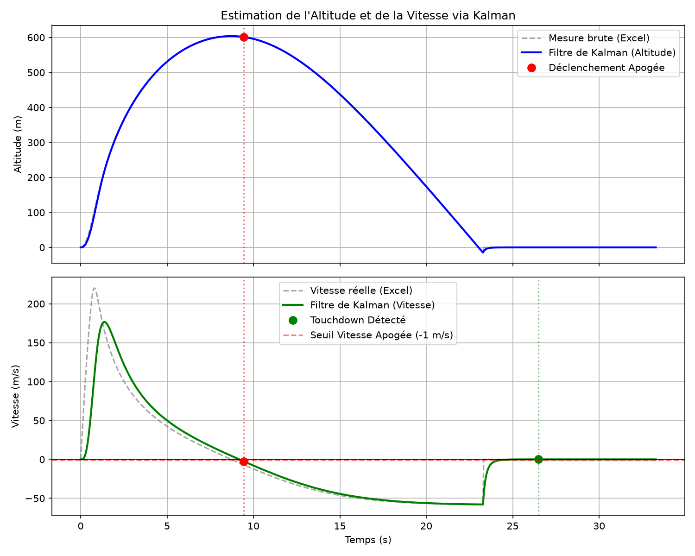

# Outils de Simulation et Vérification du Filtre de Kalman

Ce dossier contient les scripts Python permettant de simuler et valider le comportement du filtre de Kalman 1D du logiciel de vol à l'aide de données de vol réelles ou théoriques.

---

## 1. Description de la Simulation

Le script [simulate_flight.py](file:///c:/Users/paulm/OneDrive/Documents/PlatformIO/Projects/FlightSoftware-Mastodonte/tools/simulate_flight.py) reproduit fidèlement la logique embarquée C++ :
* **Cadencement à 25 Hz** : Les données temporelles variables de l'Excel sont interpolées linéairement pour correspondre à la période d'échantillonnage réelle de la fusée ($dt = 40\text{ ms}$).
* **Algorithme de Kalman 1D** : Implémentation des équations de prédiction et de mise à jour (Correction) de l'altitude ($z$) et de la vitesse ($v_z$).
* **Automate de vol (FSM)** : Simulation des états `ASCEND`, `DESCEND` et `TOUCHDOWN`.
* **Détection d'Apogée** : Déclenchement de l'apogée si l'altitude $z > 15\text{ m}$ et la vitesse de Kalman $v_z < -1.0\text{ m/s}$ sur 5 cycles consécutifs (~200 ms).
* **Détection du Touchdown** : Déclenchement de l'atterrissage si la vitesse absolue $|v_z| < 0.5\text{ m/s}$ sur 50 cycles consécutifs (~2 secondes).

---

## 2. Guide d'Installation et d'Exécution

Un environnement virtuel Python (`.venv`) a été configuré à la racine du projet.

### Étape A : Activation de l'environnement virtuel

* **Sur Windows (PowerShell) :**
  ```powershell
  .venv\Scripts\Activate.ps1
  ```
* **Sur Windows (Invite de commandes CMD) :**
  ```cmd
  .venv\Scripts\activate.bat
  ```

*(Optionnel) Si l'environnement virtuel n'est pas créé ou s'il manque des packages, installez-les via :*
```bash
pip install -r tools/requirements.txt
```

### Étape B : Exécuter la simulation

Vous pouvez exécuter le script directement en spécifiant le chemin de l'interpréteur de l'environnement virtuel :
```powershell
.venv\Scripts\python.exe tools/simulate_flight.py
```
Ou si l'environnement virtuel est activé :
```bash
python tools/simulate_flight.py
```

---

## 3. Analyse des Résultats

Le script génère deux types de retours :

### A. Rapport Console (Exemple de sortie)
```text
========================================
     RESULTATS DE LA SIMULATION KALMAN
========================================
Paramètres utilisés : Q_alt=0.1, Q_vel=0.5, R_alt=1.0
Apogée réelle Excel   : 603.48 m à t = 8.72 s
Détection de l'apogée : 601.30 m à t = 9.44 s
  -> Retard de déclenchement : 0.720 s
  -> Perte d'altitude        : 2.18 m
Détection de l'atterrissage à t = 26.48 s (impact à t = 23.28s)
  -> Retard après impact : 3.20 s
```

### B. Graphiques de Simulation (`flight_simulation.png`)
Le script génère et sauvegarde un graphique nommé `flight_simulation.png` dans ce dossier `tools/` (ce fichier est configuré dans le `.gitignore` pour ne pas encombrer le dépôt git).

Voici un aperçu du rendu obtenu avec les réglages de confiance par défaut ($Q_{\text{alt}}=0.1$, $Q_{\text{vel}}=0.5$, $R_{\text{alt}}=1.0$) :

<p align="center">
  
</p>

Le graphique contient deux courbes synchronisées :
1. **Altitude** : Affiche les mesures brutes du baromètre (Excel) par rapport à l'altitude estimée par le filtre de Kalman, ainsi que le point précis du déclenchement de l'apogée.
2. **Vitesse verticale ($v_z$)** : Affiche la vitesse réelle issue d'Excel face à la vitesse estimée par Kalman, le seuil de détection d'apogée ($-1.0\text{ m/s}$), le point d'apogée détecté et le point de Touchdown.


---

## 4. Ajustement des Paramètres de Confiance (Tuning)

Pour optimiser ou tester le comportement du filtre, vous pouvez modifier les variances de bruit directement au début du fichier [simulate_flight.py](file:///c:/Users/paulm/OneDrive/Documents/PlatformIO/Projects/FlightSoftware-Mastodonte/tools/simulate_flight.py) (lignes 32-34) :

```python
Q_alt = 0.1   # Variance de l'incertitude sur l'altitude théorique (Process Noise)
Q_vel = 0.5   # Variance de l'incertitude sur la vitesse théorique (Process Noise)
R_alt = 1.0   # Variance du bruit de mesure du baromètre (Measurement Noise)
```

### Règles de réglage :
* **Augmenter $R_{\text{alt}}$ ou diminuer $Q_{\text{vel}}$** : Le filtre fait moins confiance au capteur. La courbe estimée sera très **lisse** et moins sensible au bruit, mais cela introduira du **retard** sur la détection de l'apogée.
* **Diminuer $R_{\text{alt}}$ ou augmenter $Q_{\text{vel}}$** : Le filtre fait plus confiance aux mesures brutes. L'estimation sera très **réactive** (retard faible), mais potentiellement **bruitée**, ce qui augmente le risque de fausses détections d'apogée dues au bruit de mesure.
